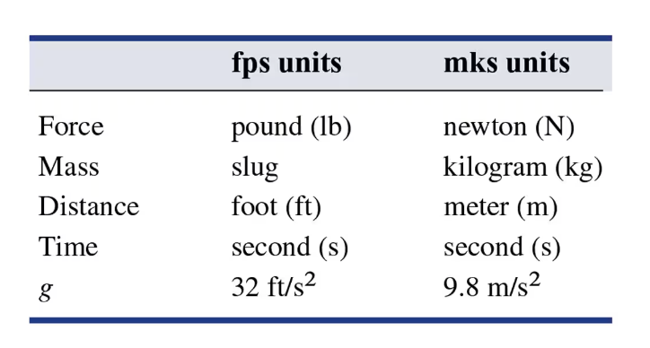

::: frame
### Some special cases of first order ODE

The most general form of a first-order ODE is
$$\frac{dy}{dx} = f(x,y).$$ The special case (where the independent
variable doesn't appear in the ODE) $$\frac{dy}{dx} = f(y)$$ is called
*autonomous* --- the "law of nature\" (the ODE) doesn't depend on the
independent variable. For many phenomena, we first consider the simpler
case with these "static laws of nature\" since they're simpler to
analyze [^1], before considering a refined model of the form
$\frac{dy}{dx} = f(x,y).$\
:::

::: frame
The "opposite\" special case would be $$\frac{dy}{dx} = f(x),$$ where
the differential equation doesn't actually involve the unknown function
itself.\
While technically still a differential equation, it's "easy\" in the
sense that it can be solved for $y(x)$ by simply antidifferentiating
$f(x)$: $$y(x) = \int f(x) \, dx + C.$$
:::

::: frame
**Example.** Consider $\frac{dy}{dx} = e^{2x} + x^2$.

(a) Find the general solution.

(b) Find the particular solution satisfying $y(1)=3$.

(c) Take a look on Desmos!
:::

::: frame
This "solvable by directly integrating\" also works for equations of the
following forms: $$\begin{aligned}
\frac{d^2y}{dx^2} &= f(x) , \\
\frac{d^3y}{dx^3} &= f(x) , \\
&\vdots\\
\frac{d^ny}{dx^n} &= f(x) .
\end{aligned}$$ We obtain one integration constant per derivative we
undo, and so we obtain an $n$-parameter family for the $n$th-order
"antiderivative equation\".
:::

::: frame
### Position, velocity, and acceleration

We consider a particle moving along the $x$-axis with
*position/displacement* given by $$x=f(t).$$ Its *velocity* is
$$v = \frac{dx}{dt} = f'(t),$$ and its *speed* is $|v|$. Its
*acceleration* is $$a = \frac{dv}{dt} = \frac{d^2x}{dt^2} = f''(t).$$ If
$m$ is the mass of the particle, Newton's second law states
$$m a(t) = F(t)$$ where $F(t)$ is the force acting on the particle along
its line of motion.
:::

::: frame
### Constant acceleration

In the special case where the acceleration doesn't depend on time:
$$a(t) = a,$$ we can integrate to obtain $$v(t) = at + v_0$$ where
$v_0 = v(0)$ is the *initial velocity*. We can integrate again to obtain
$$x(t) = \frac 1 2 a t^2 + v_0t + x_0,$$ where $x_0 = x(0)$ is the
*initial position*.
:::

::: frame
### We can already do some rocket science\...

A lunar lander is falling freely toward the surface of the moon at a
speed of 450 m/s.\
Its thrusters cause the lander to decelerate at 2.5 m/s$^2$ (after the
moon's gravitational acceleration is accounted for).\
At what height above the surface should the thrusters be activated to
ensure a "soft touchdown\" ($v=0$ on impact)?
:::

::: frame
### Units

\
The *weight* of an object is the force exerted by gravity on the object,
so at sea level on Earth is $mg$.
:::

::: frame
**Example.** A projectile is fired straight upward with an initial
velocity of 100 m/s from the top of a building 20 m high and falls to
the ground at the base of the building. Find

(a) its maximum height above the ground

(b) when it passes the top of the building

(c) its total time in the air
:::

[^1]: We'll completely understand the qualitative behavior of any first
    order autonomous ODE in section 2.2.
